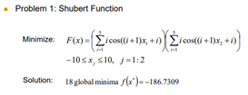
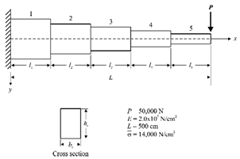

# Genetic Algorithm

## Overview

This project implements a Genetic Algorithm (GA) in Python. The main steps are as follows:

1. **Initialize Parameters**: Declare the following:
   - Number of generations
   - Number of chromosomes per generation
   - Number of genes per chromosome
   - Crossover rate
   - Mutation rate
   - Reproduction rate
2. **Encoding**: Generate the initial population (first generation).
3. **Decoding**: Decode chromosomes into decimal values, ensuring the results fall within the specified range.
4. **Fitness Calculation**: Evaluate the decoded results using the given equation to compute fitness. Collect the minimum fitness value of each generation.
5. **Proportion Calculation**: Determine the probability of selecting each chromosome based on fitness for the roulette wheel selection.
6. **Roulette Wheel Selection**: Choose the method to generate offspring based on the roulette wheel.
7. **Generate Offspring**: Use the selected method to generate offspring.
8. **Replace Parent Generation**: Replace the parent generation with the offspring.
9. **Repeat Steps 2–8**: Iterate for the specified number of generations.
10. **Plot Results**: Visualize the results.

## Implementation Details

- After encoding, chromosomes are stored as a list:
  ```python
  ['Gene1', 'Gene2']
  ```
- A generation would look like:
  ```python
  [['gene1', 'gene2'],
   ['gene1', 'gene2'],
   ['gene1', 'gene2']]
  ```
- After decoding, each chromosome includes decoded values:
  ```python
  [['gene1', 'gene2', 'decoded_gene1', 'decoded_gene2'], 
   ['gene1', 'gene2', 'decoded_gene1', 'decoded_gene2'],
   ['gene1', 'gene2', 'decoded_gene1', 'decoded_gene2']]
  ```
- After calculating fitness, each chromosome includes fitness values:
  ```python
  [['gene1', 'gene2', 'decoded_gene1', 'decoded_gene2', 'fitness'],
   ['gene1', 'gene2', 'decoded_gene1', 'decoded_gene2', 'fitness'],
   ['gene1', 'gene2', 'decoded_gene1', 'decoded_gene2', 'fitness']]
  ```
- After calculating proportion, each chromosome includes selection probability:
  ```python
  [['gene1', 'gene2', 'decoded_gene1', 'decoded_gene2', 'fitness', 'proportion'],
   ['gene1', 'gene2', 'decoded_gene1', 'decoded_gene2', 'fitness', 'proportion'],
   ['gene1', 'gene2', 'decoded_gene1', 'decoded_gene2', 'fitness', 'proportion']]
  ```
- Proportion Calculation: 
  Calculate selection probabilities by subtracting each fitness value from the maximum fitness value (max_fitness - fitness + 1), ensuring that even the best fitness has a chance of selection. You can also apply an exponent to amplify the differences.
- Crossover: 
  Choose a random crossover point. If there are two variables (x1, x2) and 10 genes per chromosome, there are 19 possible crossover points. Two offspring are generated and collected.
- Mutation: 
Perform a 0-to-1 or 1-to-0 flip for all genes.
- Reproduction: 
  Copy the selected parent directly into the offspring population.
---
### Question 1

#### Parameters:
- **Gene Length**: 10  
- **Chromosomes per Generation**: 1000  
- **Generations**: 200  
- **Crossover Rate**: 0.75  
- **Mutation Rate**: 0.05  
- **Reproduction Rate**: 0.20  

#### Results:
- **x₁**: -7.086999022482893  
- **x₂**: -1.4173998044965792  
- **Minimum Fitness**: -186.56443970911963
 

#### Observations:
- With a large population size, convergence occurs quickly, reducing the need for many generations.
---
### Question 2

#### Parameters:
- **Gene Length**: 10  
- **Chromosomes per Generation**: 1000  
- **Generations**: 200  
- **Crossover Rate**: 0.75  
- **Mutation Rate**: 0.05  
- **Reproduction Rate**: 0.20  

#### Results:
- **x₁**: -0.09609384164222945  
- **x₂**: -0.03203128054740745  
- **x₃**: -0.22421896383186635  
- **x₄**: -0.09609384164222945  
- **x₅**: 0.03203128054740745  
- **Minimum Fitness**: 1.0642861345982308


#### Observations:
- With a large population size, convergence occurs quickly, reducing the need for many generations.  
- However, the algorithm struggles to converge to values below 1.  
- Increasing the population size leads to rapid initial improvements but does not enhance the final convergence result.  
- Adjusting the proportions of genetic operations had little effect on the final outcome.
---
### Question 3

#### Parameters:
- **Gene Length**: 10  
- **Chromosomes per Generation**: 1000  
- **Generations**: 200  
- **Crossover Rate**: 0.75  
- **Mutation Rate**: 0.05  
- **Reproduction Rate**: 0.20  

#### Results:
- **α (alpha)**: 3.6021505376344085  
- **β (beta)**: 4.457478005865102  
- **δ (delta)**: 17.086999022482892  
- **a**: 28.58260019550342  
- **b**: 10.048875855327468  
- **RMSE**: 732.9345328092538


#### Observations:
-  The convergence performance was very poor. While some generations recorded good fitness values, these could not be preserved in the subsequent generations, leading to significant oscillations.  
- Occasionally, exceptional results were observed, likely due to the large population size, increasing the probability of finding outstanding individuals.  
-  The issue seems to be related to the genetic operation strategies. Adjusting the proportions of genetic operations did not yield significant improvements.

---
# Particle Swarm Optimization

## Overview

The steps for implementing the Particle Swarm Optimization (PSO) algorithm are as follows:

1. **Initialization**:
   - Declare the number of particles, number of iterations, range of values, and the parameters `w`(inertia weight), `c1`, and `c2`(positive weighting factors).
2. **Generate Initial Positions**:
   - Create initial positions within the problem-defined range.
3. **Particle Movement**:
   - Calculate the fitness and personal best (`pbest`) for each particle.
     - **Note**: During the first iteration, since no velocity is assigned, fitness is calculated directly from the initial positions, which are also set as the initial `pbest`.
4. **Determine Global Best (`gbest`)**:
   - Select the best `pbest` from all particles as the `gbest` and record it for visualization.
5. **Velocity Update**:
   - Use the `gbest` information to update the velocity (vector) for each particle.
6. **Repeat**:
   - Repeat steps 3–5 for the specified number of iterations.
7. **Visualization**:
   - Plot the results.

---

## Implementation Details

- **Programming Language**: Python  

- **Data Representation**:
  - Each particle is stored in the following structure (demonstrated for a problem with two variables, `x` and `y`):
    ```python
    ['now_x', 'now_y', 'v_x', 'v_y', 'pbest_x', 'pbest_y', 'pbest_value']
    ```
    - `now_x`, `now_y`: Current coordinates of the particle.  
    - `v_x`, `v_y`: Current velocity components in the `x` and `y` directions.  
    - `pbest_x`, `pbest_y`: Coordinates of the best position found by the particle so far.  
    - `pbest_value`: The best fitness value found by the particle.  

- **Boundary Handling**:
  - To prevent particles from moving out of the problem-defined range, any particle that encounters a boundary will halt its movement at the boundary. It will wait for velocity updates and proceed in the next iteration.

- **`pbest` Update**:
  - If the fitness value obtained during the current movement is not better than the previous `pbest`, the particle retains its previous `pbest` position and value without updates.

---

## Notes
- Boundary conditions are strictly enforced to maintain consistency with the problem constraints.  
- Use visualization to track convergence trends and evaluate the performance of the PSO algorithm.
---
### Question 1

#### Parameters:
- **Number of Particles**: 20  
- **Number of Iterations**: 50  
- **Inertia Weight (w)**: 0.729  
- **Cognitive Coefficient (c1)**: 1.49445  
- **Social Coefficient (c2)**: 1.49445  

#### Results:
- **x₁**: 5.482853842888297  
- **x₂**: 4.8580637744432895  
- **Minimum Fitness**: -186.73090848284681
 

#### Observations:
1. A small number of particles and iterations is sufficient for convergence.  
2. The results are satisfactory, comparable to those obtained using Genetic Algorithm (GA) for this problem.
---
### Question 2

#### Parameters:
- **Number of Particles**: 80  
- **Number of Iterations**: 100  
- **Inertia Weight (w)**: 0.729  
- **Cognitive Coefficient (c1)**: 1.49445  
- **Social Coefficient (c2)**: 1.49445  

#### Results:
- **x₁**: 1.1523741644652962e-06  
- **x₂**: -2.2924912517639888e-06  
- **x₃**: -1.6674808006973245e-06  
- **x₄**: -7.750751661916521e-07  
- **x₅**: 1.4847519892728303e-06  
- **Minimum Fitness**: 6.240438470417331e-06
 

#### Observations:
1. A moderate number of particles and iterations is sufficient for convergence.  
2. The result is significantly better than that achieved using the Genetic Algorithm (GA) for this problem.
---
### Question 3

#### Parameters:
- **Number of Particles**: 150  
- **Number of Iterations**: 150  
- **Inertia Weight (w)**: 0.729  
- **Cognitive Coefficient (c1)**: 1.49445  
- **Social Coefficient (c2)**: 1.49445  

#### Results:
- **α (alpha)**: 3.3943571284051193  
- **β (beta)**: 4.037332972929989  
- **δ (delta)**: 17.84784571581737  
- **a**: 32.052492229763786  
- **b**: 10.977557075441  
- **RMSE**: 309.8083293811385


#### Observations:
1. This problem required a relatively large number of particles, but convergence was achieved with a moderate number of iterations.  
2. The result is significantly better than that achieved using the Genetic Algorithm (GA).  
3. The RMSE is approximately 310, suggesting there is room for improvement. However, based on the shape of the original data curve, achieving perfect overlap with the original graph would require more than two wave components. Thus, the result is acceptable.
---
### Question 4

#### Parameters:
- **Number of Particles**: 20  
- **Number of Iterations**: 50  
- **Inertia Weight (w)**: 0.729  
- **Cognitive Coefficient (c1)**: 1.49445  
- **Social Coefficient (c2)**: 1.49445  

#### Results:
- **x₁**: 5.273746298854829e-05  
- **x₂**: -0.00026154930712837116  
- **Minimum Fitness**: 1000.0000000711896


#### Observations:
1. A small number of particles and iterations is sufficient for convergence.  
2. The result is exceptionally good for this problem.
---
### Question 5


#### Parameters:
- **Number of Particles**: 200  
- **Number of Iterations**: 100  
- **Inertia Weight (w)**: 0.729  
- **Cognitive Coefficient (c1)**: 1.49445  
- **Social Coefficient (c2)**: 1.49445  

#### Results:
- **b₁**: 0.5000002143320241, **h₁**: 146.3861041763292, **volume₁**: 7319.308346339461  
- **b₂**: 0.5000002182526229, **h₂**: 130.9308072041377, **volume₂**: 6546.543217806094  
- **b₃**: 0.5000004119789387, **h₃**: 113.3896000686435, **volume₃**: 5669.484674844885  
- **b₄**: 0.5000000322287507, **h₄**: 92.58224809572938, **volume₄**: 4629.112703167489  
- **b₅**: 0.5000000000000034, **h₅**: 65.46582178558624, **volume₅**: 3273.2910892793348  
- **Total Volume**: 27,437.740031437264


#### Approach:
- This problem was divided into 5 sections, with each section optimized separately to find the best solution and calculate the respective volumes. The total volume is the sum of the 5 individual volumes.  
- Unlike previous problems, the calculated values of `h` and `b` must be verified against a stress equation to ensure the stress does not exceed the allowable limit.  
- If the stress is too high for a given `h` and `b`, they are reset to their "worst-case solution" values (`h = 50` and `b = 200`). This ensures that the values are brought back within the feasible range for further optimization.  
- In the original paper, it was suggested to reset the velocity of violated points; in this implementation, the position of violated points is reset instead.

#### Observations:
1. The algorithm successfully converged to an excellent result.  
2. The final results closely match the theoretical values, validating the effectiveness of the approach.

